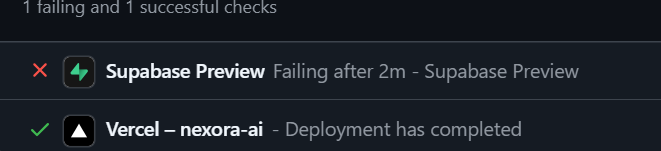

# 🚀 Quick Start: Complete Your MediCura AI Rebrand

## ✅ What's Done
Your app is fully rebranded to **MediCura AI** in the code. All user-facing text, meta tags, and URLs are updated.

---

## 🎯 What You Need to Do (5 Simple Steps)

### Step 1: Create the Domain Config File (2 minutes)

Go to your forked `is-a-dev/register` repository on GitHub and create a new file:

**File path:**
```
domains/medicura-ai.json
```

**File content:**
```json
{
  "owner": {
    "username": "adithyanks2005",
    "email": "ksadithyan2021.com"
  },
  "record": {
    "CNAME": "cname.vercel-dns.com"
  }
}
```

⚠️ **Replace `PUT-YOUR-EMAIL-HERE@example.com` with your actual email!**

---

### Step 2: Submit the Pull Request (3 minutes)

1. Go to: https://github.com/is-a-dev/register/compare
2. Click **"compare across forks"**
3. Select **your fork** as the "head repository"
4. You should see your new `domains/medicura-ai.json` file
5. Title: **Add medicura-ai.is-a.dev**
6. Description:
```
Requesting medicura-ai.is-a.dev subdomain for MediCura AI healthcare assistant.

- New domain: medicura-ai.is-a.dev
- Type: Healthcare web application  
- Owner: @adithyanks2005
- CNAME: cname.vercel-dns.com (Vercel deployment)
```
7. Click **Create Pull Request**

---

### Step 3: Wait for Approval (1-3 days)

- You'll get an email notification when your PR is approved
- The `medicura-ai.is-a.dev` domain will become active immediately
- Nothing to do during this wait — just check your email!

---

### Step 4: Add Domain to Vercel (2 minutes)

**Once your PR is approved:**

1. Go to: https://vercel.com/dashboard
2. Select your **nexora-ai** project
3. Click **Settings** → **Domains**
4. Click **Add Domain**
5. Enter: `medicura-ai.is-a.dev`
6. Click **Add**
7. Vercel will verify automatically (should be instant ✅)
8. Click the **•••** menu next to the domain
9. Select **Set as Primary Domain** (optional but recommended)

---

### Step 5: Deploy Changes (1 minute)

Open your terminal and run:

```cmd
cd c:\Users\adith\Documents\nexora-ai
git add .
git commit -m "Rebrand to MediCura AI with medicura-ai.is-a.dev domain"
git push
```

Vercel will automatically build and deploy your changes. Wait 2-3 minutes, then visit:

**https://medicura-ai.is-a.dev** 🎉

---

## 🎊 You're Done!

Your site is now live as **MediCura AI** at `medicura-ai.is-a.dev`!

---

## 📈 Bonus: Google Search Console (Optional but Recommended)

To get indexed faster:

1. Go to: https://search.google.com/search-console
2. Click **Add Property**
3. Enter: `https://medicura-ai.is-a.dev`
4. Verify ownership (HTML tag method is easiest)
5. Submit sitemap: `https://medicura-ai.is-a.dev/sitemap.xml`
6. Request indexing for homepage
7. Wait 3-7 days for Google to index your site

Then search **"medicura ai"** on Google and you'll see your site! 🔍

---

## ❓ Common Questions

**Q: Will my old domain still work?**  
A: Yes! `nexora-ai-flax.vercel.app` will auto-redirect to the new domain.

**Q: Will I lose user data?**  
A: No! All localStorage data stays intact.

**Q: Can I test before the domain is approved?**  
A: Yes! Visit `nexora-ai-flax.vercel.app` — all branding is already "MediCura AI"

**Q: What if my PR is rejected?**  
A: Very rare! Just fix the issue they mention and resubmit. Common fixes:
- Wrong email format
- Typo in CNAME record
- Domain name already taken (unlikely)

**Q: How long until Google shows "MediCura AI" instead of "Vercel"?**  
A: 1-2 weeks after the new domain is live and indexed.

---

## 📞 Need Help?

- **Domain not approved?** Comment on your GitHub PR
- **Vercel issues?** Check https://vercel.com/docs/concepts/projects/domains
- **Other questions?** Review `REBRAND_SUMMARY.md` in this folder

---

**Good luck! 🚀 Your app is about to rank #1 for "medicura ai"!**
